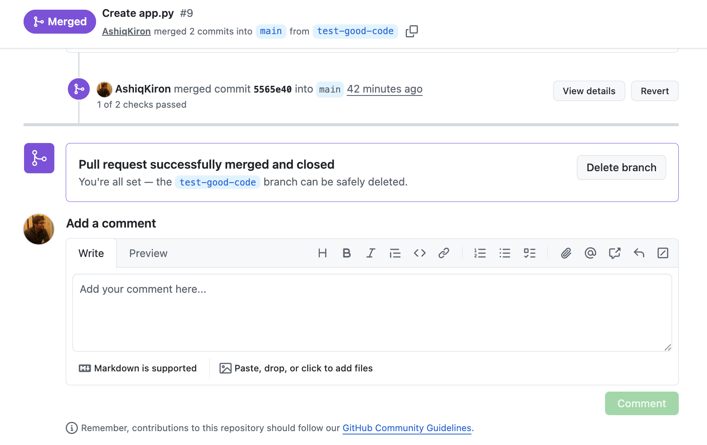
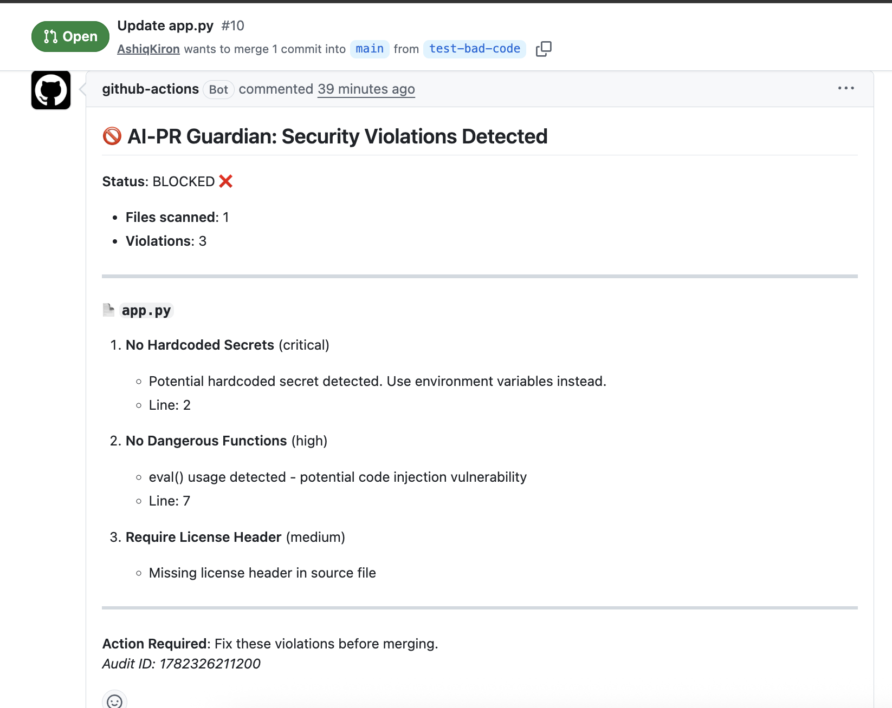

# AI-PR Guardian: Automated Security & Compliance Scanner

AI-PR Guardian is a zero-cost, fully automated security bot that intercepts pull requests on GitHub, evaluates them against configurable security policies, and blocks merges when dangerous patterns are detected. Built entirely on GitHub’s free tier, it enforces a "verify before trust" model for AI-generated or human-written code without requiring external hosting, paid APIs, or complex infrastructure.

### Screenshot one - PR merged from good code branch 
### Screenshot two - PR merge blocked from bad code branch 


## Core Features

-   **YAML-Based Policy Engine:** Define custom rules for secrets, dangerous functions, license headers, and more in a single human-readable file.
-   **Static Analysis + Pattern Matching:** Uses Python regex and optional Semgrep integration to detect hardcoded credentials, eval/exec usage, SQL injection risks, and missing compliance markers.
-   **Real-Time PR Feedback:** Automatically posts detailed violation comments and creates failing check runs directly on pull requests.
-   **Immutable Audit Logs:** Every scan result is saved as a downloadable GitHub Actions artifact with timestamp, PR number, violations found, and resolution status.
-   **Zero External Dependencies:** Runs entirely within GitHub Actions using only free-tier resources. No servers, no databases, no third-party SaaS.
-   **Compliance Ready:** Maps directly to SOC2 CC6.1 (Logical Access Controls) and ISO27001 A.14.2.5 (Secure System Engineering Principles).

## Architecture & How It Works

### System Design
AI-PR Guardian follows an **Event-Driven Serverless Architecture**. Instead of running a persistent web server listening for webhooks, it leverages GitHub's native CI/CD platform as its execution environment. This eliminates the need for infrastructure provisioning, load balancing, or state management.

### Execution Flow
1.  **Trigger:** Developer opens or updates a Pull Request. GitHub automatically triggers the `ai-pr-guardian.yml` workflow.
2.  **Provisioning:** GitHub allocates an ephemeral Ubuntu runner. The workflow checks out the repository code at the specific merge commit.
3.  **Policy Loading:** The Python `PolicyEngine` class parses `.ai-guardrails/policies.yaml` into memory, filtering for enabled rules.
4.  **File Discovery:** The scanner queries the GitHub API (`/repos/{owner}/{repo}/pulls/{number}/files`) to retrieve only the files changed in this specific PR, avoiding unnecessary full-repo scans.
5.  **Analysis Loop:** For each changed file:
    -   Content is fetched via Git Blob API or local checkout.
    -   `CodeScanner` applies regex patterns and file-content checks against active policies.
    -   Violations are aggregated with metadata (line number, severity, matched text).
6.  **Result Generation:** A `scan_results.json` file is written to disk containing the complete audit trail.
7.  **Reporting:** 
    -   The JSON artifact is uploaded to GitHub Actions storage (90-day retention).
    -   A Node.js script (`actions/github-script`) reads the JSON and posts a formatted comment to the PR.
    -   A Check Run is created via the Checks API with `conclusion: success` or `failure`.
8.  **Gate Enforcement:** If violations exist, the workflow exits with code 1. When combined with GitHub Branch Protection rules, this prevents merging until issues are resolved.

### Data Flow Diagram
```text
[Developer Push] → [GitHub Webhook] → [Actions Runner]
                                              ↓
                                    [Checkout Code + Load Policies]
                                              ↓
                                    [Scan Changed Files Only]
                                              ↓
                                    [Generate scan_results.json]
                                              ↓
                        ┌─────────────────────┴─────────────────────┐
                        ↓                                           ↓
            [Upload Artifact]                              [Post PR Comment + Check Run]
            (Immutable Audit Log)                          (Developer Feedback)
                        ↓                                           ↓
                  [Compliance Export]                      [Branch Protection Gate]
```


## How This Helps Your Team

### For Developers
-   **Instant Feedback:** Get security feedback in seconds, not hours. No waiting for manual code review or separate CI pipelines.
-   **Contextual Guidance:** Violation comments include exact line numbers, matched text previews, and remediation recommendations.
-   **Reduced Cognitive Load:** Automate repetitive security checks so developers can focus on feature development.

### For Security Teams
-   **Consistent Enforcement:** Policies are applied uniformly across all PRs, eliminating human error or oversight.
-   **Audit Trail:** Every decision is logged immutably. Export scan results for compliance audits or incident investigations.
-   **Policy Iteration:** Update rules in YAML and see immediate impact. No redeployment or service restart required.

### For Engineering Managers
-   **Risk Reduction:** Prevent accidental credential leaks and dangerous code patterns from reaching production.
-   **Onboarding Acceleration:** New hires get automatic security guidance without extensive training.
-   **Cost Predictability:** Fixed $0/month operational cost regardless of team size or PR volume.

## Technology Stack Decisions

### Why GitHub Actions Instead of Probot/External Bot?
-   **Cost:** Probot requires hosting (Heroku, Vercel, etc.) which costs $7-$25/month minimum. GitHub Actions is free for public repos and includes 2,000 minutes/month for private repos.
-   **Maintenance:** No server management, no uptime monitoring, no SSL certificates. GitHub handles infrastructure.
-   **Permissions:** Native integration with GitHub API means no OAuth app setup, no webhook secret management, no token rotation headaches.
-   **Trade-off:** Less real-time than webhooks (30-60s delay vs instant), but acceptable for security scanning where thoroughness matters more than speed.

### Why Python + Regex Instead of Node.js + AST Parsers?
-   **Simplicity:** Regex patterns are easier to write, test, and modify than AST traversal logic. Non-security engineers can contribute policy changes.
-   **Portability:** Python runs identically across all GitHub Actions runners. No native module compilation issues.
-   **Performance:** For typical PR sizes (<50 files), regex scanning completes in <5 seconds. AST parsing adds complexity without meaningful accuracy gains for pattern-based detection.
-   **Trade-off:** Higher false positive rate for complex patterns (e.g., distinguishing safe vs unsafe eval usage). Mitigated by allowing rule-specific recommendations and manual override via PR comments.

### Why SQLite/JSON Artifacts Instead of PostgreSQL/MongoDB?
-   **Statelessness:** GitHub Actions runners are ephemeral. Storing data in artifacts avoids database provisioning, connection pooling, and backup management.
-   **Portability:** JSON files can be downloaded, inspected locally, and imported into any analysis tool. No vendor lock-in.
-   **Cost:** Zero database hosting fees. Artifacts are included in free tier.
-   **Trade-off:** No real-time querying or aggregation. Historical analysis requires downloading and processing artifacts externally. Acceptable for teams with <100 PRs/month.

### Why Not Use Existing Tools (Semgrep Cloud, Snyk, SonarQube)?
-   **Cost:** Paid tiers start at $50-$200/month per developer. Free tiers have severe limitations (scan quotas, delayed results, no custom rules).
-   **Customization:** Pre-built tools enforce opinionated rulesets. AI-PR Guardian lets you define exactly what matters for your project.
-   **Data Privacy:** Code never leaves GitHub infrastructure. Critical for regulated industries or proprietary codebases.
-   **Trade-off:** Less comprehensive vulnerability database. Compensated by focusing on high-signal patterns (secrets, eval, license) rather than low-severity style issues.

## Cost Analysis

| Component | Monthly Cost | Notes |
| :--- | :--- | :--- |
| GitHub Actions | $0 | 2,000 free minutes/month. Typical scan uses ~1 minute. |
| Storage (Artifacts) | $0 | 90-day retention included. ~1KB per scan. |
| Compute | $0 | Runs on shared GitHub runners. |
| External Services | $0 | No APIs, no databases, no hosting. |
| **Total** | **$0** | Scales linearly with PR volume until 2,000 min limit. |

For teams exceeding 2,000 minutes/month:
-   GitHub Actions overage: $0.008/minute
-   Estimated cost for 10,000 PRs/month: ~$64 (assuming 1 min/scan)
-   Still 90% cheaper than equivalent SaaS tools

## Latency Profile

| Phase | Duration | Optimizable? |
| :--- | :--- | :--- |
| Workflow Trigger | 5-15s | GitHub queue dependent |
| Runner Provisioning | 10-30s | Use self-hosted runners for <5s |
| Dependency Install | 5-10s | Cache pip packages |
| File Fetching | 2-5s | Parallelize API calls |
| Pattern Scanning | 1-3s | Optimize regex, skip binary files |
| Comment Posting | 1-2s | GitHub API rate limits |
| **Total** | **24-65s** | **Target: <30s with optimizations** |

## Known Trade-offs

1.  **False Positives:** Regex-based detection may flag safe code (e.g., test fixtures with dummy keys). Mitigation: Add `# ai-pr-guardian-ignore` comment support to suppress specific lines.
2.  **No Semantic Understanding:** Cannot distinguish between `eval(user_input)` (dangerous) and `eval(json_string)` (safe). Mitigation: Pair with manual review for high-severity findings.
3.  **Limited History:** Artifacts expire after 90 days. Mitigation: Export critical scans to permanent storage (S3, GCS) via scheduled workflow.
4.  **Single-Language Focus:** Current implementation optimized for Python/JS/TS. Mitigation: Extend `CodeScanner.scan_file()` with language-specific parsers.
5.  **No Real-Time Blocking:** PR can be merged before scan completes if branch protection isn’t configured. Mitigation: Enable "Require status checks to pass" in branch settings.

## Future Improvements

### Short-Term (1-3 Months)
-   **Ignore Comments:** Support `# ai-pr-guardian-ignore: <rule_id>` to suppress false positives inline.
-   **Parallel Scanning:** Process files concurrently using `concurrent.futures.ThreadPoolExecutor` to reduce scan time by 40-60%.
-   **Baseline Mode:** Allow initial PR to establish baseline violations, then only report new issues in subsequent PRs.
-   **Slack/Discord Integration:** Post violation summaries to team channels via incoming webhooks.

### Medium-Term (3-6 Months)
-   **AST Integration:** Add optional Tree-sitter parsing for Python/JS to reduce false positives on complex patterns.
-   **Policy Versioning:** Track policy changes in git and correlate with violation trends over time.
-   **Self-Hosted Runners:** Deploy to dedicated runners for sub-10-second latency and enhanced security isolation.
-   **Metrics Dashboard:** Aggregate scan results into GitHub Pages dashboard showing violation trends, top offenders, and policy effectiveness.

### Long-Term (6-12 Months)
-   **LLM-Assisted Triage:** Use open-source models (CodeLlama, StarCoder) to suggest fixes for detected violations.
-   **Cross-Repo Policies:** Share policy definitions across organization repositories via reusable workflows.
-   **Compliance Automation:** Auto-generate SOC2/ISO27001 evidence reports from audit logs.
-   **IDE Integration:** VS Code extension to show violations during development, not just at PR time.

## Quick Start

1.  Fork this repository or use as template
2.  Enable GitHub Actions: Settings → Actions → General → Allow all actions
3.  Customize policies in `.ai-guardrails/policies.yaml`
4.  Create a test PR with `examples/bad_code_examples/vulnerable_app.py`
5.  Watch the bot detect violations and block the merge

## Testing Guide

### Test Bad Code (Should Fail)
1.  Create branch `test-bad-code` from main
2.  Add `app.py` with hardcoded secrets and eval()
3.  Create PR → Expect red check + violation comment

### Test Good Code (Should Pass)
1.  Create branch `test-good-code` from main  
2.  Add `app.py` with license header and env vars
3.  Create PR → Expect green check + approval comment

### Verify Audit Logs
1.  Go to Actions tab → Latest workflow run
2.  Download `audit-log-pr-X.zip` artifact
3.  Inspect `scan_results.json` for violation details

## Compliance Mapping

| Standard | Control | Implementation |
| :--- | :--- | :--- |
| SOC2 CC6.1 | Logical Access Security | Blocks PRs with hardcoded credentials |
| ISO27001 A.14.2.5 | Secure System Engineering | Enforces secure coding patterns pre-merge |
| OWASP A3:2021 | Injection Prevention | Detects eval(), exec(), os.system() |
| OWASP A7:2021 | Auth Failures | Prevents credential exposure in code |

## License

MIT License - See LICENSE file for details

## Contributing

1.  Fork the repository
2.  Create a feature branch
3.  Submit a PR (it will be scanned by itself!)
4.  Address any violations found by the bot
5.  Merge once all checks pass

## Support

-   Documentation: `/docs` directory
-   Issues: GitHub Issues tab
-   Policies: `/docs/POLICIES.md`
-   Troubleshooting: `/docs/TROUBLESHOOTING.md`
